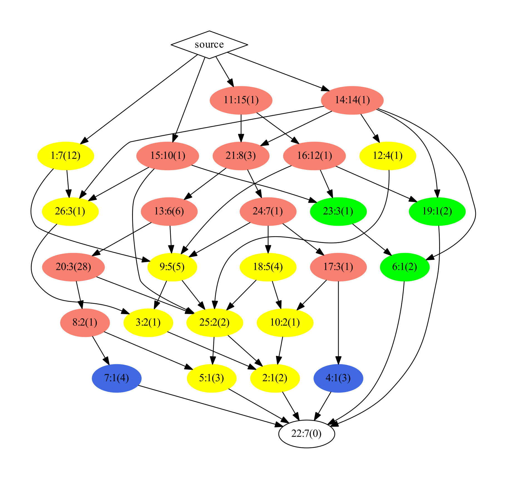

# SBOLTestSuite

The SBOLTestSuite contains the latest set of examples created using the Synthetic Biology Open Language (SBOL) Standard. The purpose of this respository is to provide examples to test applications encoding the SBOL standard. Additionally, this repository provides a characterization profile of the SBOL2 examples which determine the level of SBOL data model covered within the tests. 

The repository is organized into the following directories : 

```
1. Invalid : SBOL files that incorrectly encode the SBOL validation rules.
2. GenBank : A series of GenBank files
3. RDF :  A series of SBOL files encoded using RDF format. 
4. SBOL1 : SBOL files which encode the SBOL1 data model. 
5. SBOL2 : SBOL files that are compliant, complete, and adhere to best practices.
6. SBOL2_bp : SBOL files that are compliant and complete, but do not follow best practices. 
7. SBOL2_ic : SBOL files that are incomplete, but are compliant.
8. SBOL2_nc : SBOL files that are not compliant.
```

# Submitting a SBOL Test File

The SBOLTestSuite offers validation programs for each of the testing directories to ensure each of the files within the directories meet the requirements of that directory. For example, an example SBOL file placed in the SBOL2 directory should be compliant, complete, and should meet best practices. The SBOL2 validation script will test for this. 

Submission of new files should follow the workflow below to add new SBOL test files to the repository. 

1. [Fork](https://help.github.com/articles/fork-a-repo/) this repository.  
2. Add the test file to the correct directory as described above. 
3. Run the validation scripts found within the 'src/test' directory. 
4. If the files are successfully validated, submit a [pull request](https://help.github.com/articles/creating-a-pull-request-from-a-fork/). 

# Running Characterization Profile

In addition to having a repository that simply hosts examples representing the SBOL data model, there exists a characterization program which determines the level of SBOL support within the SBOL2 examples. This characterization profile forms clusters based on the common SBOL data types found across a set of examples. Once these clusters are created, a graph is created showing subset relations between clusters based on their data types. The graph also colors the clusters based on the type of SBOL data found within the set of examples in the cluster. The graph is paired with a text file named 'Class Relation Data' which provides extra information regarding each cluster including the data types found. 



### Retrieving Characterization Profile 

1. [Setup](http://maven.apache.org/download.cgi) Apache Maven. A tutorial on using Apache Maven is provided [here](http://maven.apache.org/guides/getting-started/index.html).

2. In the command line, change to the directory of the SBOLTestRunner (e.g. ```cd /path/to/SBOLTestSuite```) and execute the following command

```
mvn package
```

This will compile the SBOLTestSuite source files, package the compiled source into a SBOLTestSuite JAR file (```SBOLTestSuite-<version>-SNAPSHOT-withDependencies.jar```), and place the JAR file into the ```core2/target``` sub-directory.
