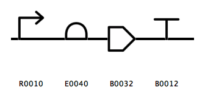

Sequence Assembly
======================

See `Full Example Code <https://pysbol2.readthedocs.io/en/latest/sbol_examples.html#id2>`_ for full example code.

-------------------------------
Template Designs
-------------------------------

One advantage of the SBOL standard over GenBank is the ability to represent DNA as components without knowing their exact sequence. A template design contains a component whose general function is known (represented by a Sequence Ontology type) while its sequence is currently either unknown or unspecified. This feature of SBOL allows the synthetic biologist to design the functional characteristics of a biological system independently of its structural characteristics. This enables a computer-aided design (CAD) approach similar to electronics, in which the functional or schematic representation of an electronic circuit can be represented separately from the physical dimensions of the electronic components.

Above is a diagram of a gene cassette, consisting of a promoter, ribosome binding site (RBS), coding sequence (CDS), and transcriptional terminator, expressed in SBOLVisual symbols. The following code creates genetic components corresponding to parts in the `iGEM registry <http://parts.igem.org/Main_Page>`_: a promoter, coding sequence (CDS), ribosome binding site (RBS), and transcriptional terminator.

.. code:: python

	gene = ComponentDefinition("BB0001")
	promoter = ComponentDefinition("R0010")
	CDS = ComponentDefinition("B0032")
	RBS = ComponentDefinition("E0040")
	terminator = ComponentDefinition("B0012")

	promoter.roles.set(SO_PROMOTER)
	CDS.roles.set(SO_CDS)
	RBS.roles.set(SO_RBS)
	terminator.roles.set(SO_TERMINATOR)

-------------------------------
Hierarchical DNA Assembly
-------------------------------
	
pySBOL includes methods for common high-level design tasks for synthetic biology such as assembly of components into functional hierarchies. This is another important advantage of the SBOL standard over GenBank. DNA sequences and biological structures in general exhibit hierarchical organization, from the genome, to operons, to genes, to lower level genetic operators. The following code example generates a hierarchical description of a gene which contains as subcomponents the previously created components. Note that these objects must be added to a Document before assembly.

.. code:: python

    gene.assemble([ promoter, RBS, CDS, terminator ])
	
-------------------------------
Sequence Assembly
-------------------------------

A complete design adds explicit sequence information to the components in a template design. In order to assemble a complete design, Sequence objects must first be created and associated with the promoter, CDS, RBS, terminator subcomponents. In contrast to the `ComponentDefinition.assemble() <https://pysbol2.readthedocs.io/en/latest/API.html#sbol.libsbol.ComponentDefinition.assemble>`_ method, which assembles a template design, the `Sequence.assemble() <https://pysbol2.readthedocs.io/en/latest/API.html#sbol.libsbol.Sequence.assemble>`_ method calculates the complete sequence of a design from the sequence of its subcomponents. You must assemble the template design prior to assembling the the complete sequence.

.. code:: python 

	promoter_seq = Sequence("R0010", "ggctgca")
	RBS_seq = Sequence("B0032", "aattatataaa")
	CDS_seq = Sequence("E0040", "atgtaa")
	terminator_seq = Sequence("B0012", "attcga")
	gene_seq = Sequence("BB0001")

	promoter.sequences.set(promoter_seq.identity.get())
	CDS.sequences.set(CDS_seq.identity.get())
	RBS.sequences.set(RBS_seq.identity.get())
	terminator.sequences.set(terminator_seq.identity.get())
	gene.sequences.set(gene_seq.identity.get())

	gene_seq.assemble()
	print(gene_seq.elements.get())
	

-------------------------------
Full Example Code
-------------------------------

Full example code is provided below, which will create a file called

.. code:: python

	setHomespace("http://sys-bio.org")
	doc = Document()

	gene = ComponentDefinition("BB0001")
	promoter = ComponentDefinition("R0010")
	CDS = ComponentDefinition("B0032")
	RBS = ComponentDefinition("E0040")
	terminator = ComponentDefinition("B0012")

	promoter.roles.set(SO_PROMOTER)
	CDS.roles.set(SO_CDS)
	RBS.roles.set(SO_RBS)
	terminator.roles.set(SO_TERMINATOR)

	doc.addComponentDefinition(gene)
	doc.addComponentDefinition(promoter)
	doc.addComponentDefinition(CDS)
	doc.addComponentDefinition(RBS)
	doc.addComponentDefinition(terminator)

	gene.assemble([ promoter, RBS, CDS, terminator ])

	first = gene.getFirstComponent()
	print(first.identity.get())
	last = gene.getLastComponent()
	print(last.identity.get())

	promoter_seq = Sequence("R0010", "ggctgca")
	RBS_seq = Sequence("B0032", "aattatataaa")
	CDS_seq = Sequence("E0040", "atgtaa")
	terminator_seq = Sequence("B0012", "attcga")
	gene_seq = Sequence("BB0001")
	
	doc.addSequence(promoter_seq)
	doc.addSequence(CDS_seq)
	doc.addSequence(RBS_seq)
	doc.addSequence(terminator_seq)
	doc.addSequence(gene_seq)
	
	promoter.sequences.set(promoter_seq.identity.get())
	CDS.sequences.set(CDS_seq.identity.get())
	RBS.sequences.set(RBS_seq.identity.get())
	terminator.sequences.set(terminator_seq.identity.get())
	gene.sequences.set(gene_seq.identity.get())

	gene_seq.assemble()
	
	print(promoter_seq.elements.get())
	print(RBS_seq.elements.get())
	print(CDS_seq.elements.get())
	print(terminator_seq.elements.get())
	print(gene_seq.elements.get())
